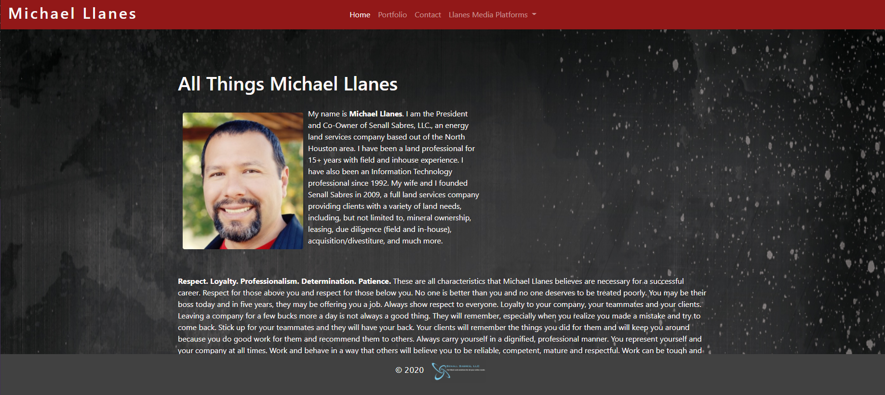
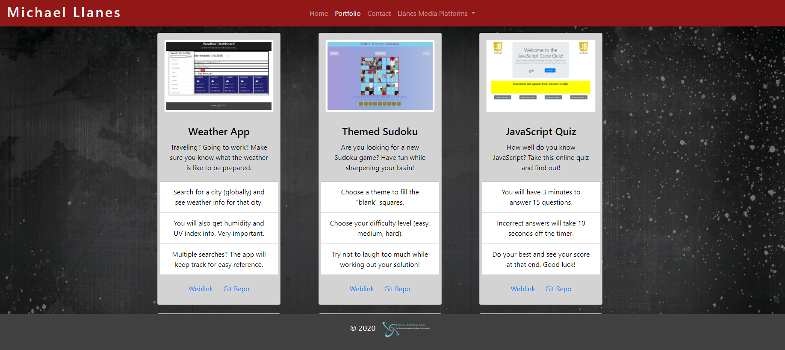
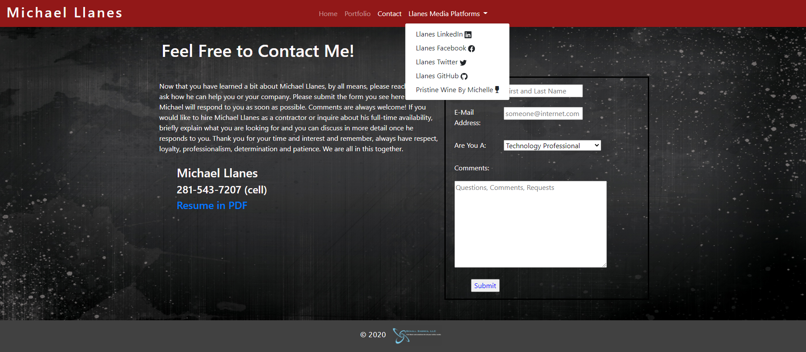

# Michael Llanes Portfolio

Hello and welcome. My name is Michael Llanes and you have found my online portfolio. Please feel free to read about me and all things that I am (that was not a typo).

## Online Portfolio Gallery

You will find several projects which I created solely and even some I collaborated on. A breif intro to each project, a weblink to the deployed sites and a link to the GitHub repository for each of the projects is included. This page will be updated as other projects will be added in the near future.

## Technologies

The following were used in the creation of this Portfolio:

- Bootstrap version 4.5.3
- Customized CSS
- FontAwesome
- For the Projects:
  - JavaScript
  - jQuery
  - OpenWeather API
  - Heroku API
  - Giphy API
  - GitHub (local repositories and linked repositories)

## Screenshots

See the following SCREENSHOTS to get an idea of what the Portfolio looks like:

## Deployed Site

https://mrllanes.github.io/Portfolio/

## Licenses

[MIT](./LICENSE) &copy; [GitHub](https://github.com/)

## Contact

For more information or to contact me for any other reason, please use the e-mail below:

- llanesm@gmail.com
